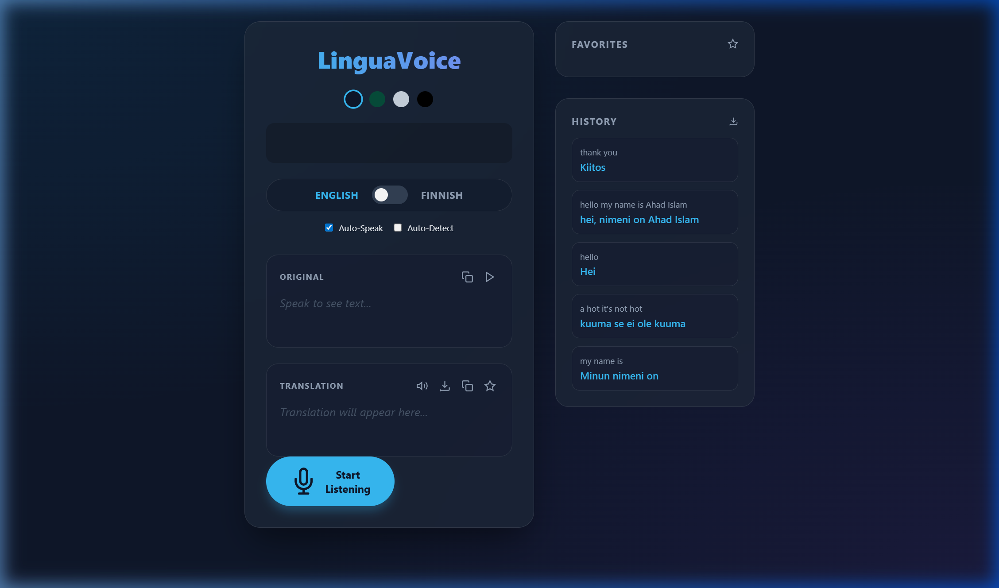

# LinguaVoice v3.0

**LinguaVoice** is a premium, real-time voice translation application designed for seamless interpretation between **English** and **Finnish**. Built with a focus on low latency and a stunning user experience, it transforms your browser into a powerful language assistant.



## ✨ Features

- **🎙️ Real-time Voice Recognition**: Powered by the Web Speech API for high-accuracy, low-latency transcription.
- **🎨 Premium Glassmorphism UI**: A modern, sleek interface with 4 unique themes (Midnight, Forest, Arctic, Obsidian).
- **🗣️ Advanced Audio Tools**:
  - **Auto-Speak**: Hear translations automatically.
  - **Original Playback**: Listen to your own transcribed voice.
  - **Voice Commands**: Control the UI with your voice (e.g., "Switch theme").
- **🧠 Intelligent Utilities**:
  - **Favorites**: Star important phrases for quick access.
  - **History**: View and manage your recent translation history.
  - **Export**: Download your translation session as a `.txt` file.
- **📱 PWA Support**: Fully installable on mobile and desktop as a Progressive Web App.

## 🛠️ Technology Stack

- **Frontend**: Vite + Vanilla JavaScript
- **Styling**: Pure CSS with advanced CSS Variables and Backdrop Filters
- **APIs**:
  - [Web Speech API](https://developer.mozilla.org/en-US/docs/Web/API/Web_Speech_API) (Recognition & Synthesis)
  - [MyMemory Translation API](https://mymemory.translated.net/doc/spec.php)
  - [Web Audio API](https://developer.mozilla.org/en-US/docs/Web/API/Web_Audio_API) (Visualizer)

## 🚀 Getting Started

### Prerequisites

- Node.js installed on your machine.
- A modern browser with Speech Recognition support (Chrome, Edge, etc.).

### Installation

1. Clone the repository:
   ```bash
   git clone https://github.com/ahadbd/lingua-voice.git
   ```
2. Navigate to the project directory:
   ```bash
   cd lingua-voice
   ```
3. Install dependencies:
   ```bash
   npm install
   ```
4. Start the development server:
   ```bash
   npm run dev
   ```

## 🎙️ Voice Commands

While listening, you can try saying these commands:
- `"Switch theme"`: Cycles through available color themes.
- `"Clear history"`: Wipes your recent translation history.
- `"Clear favorites"`: Wipes your bookmarked phrases.

## 📝 License

Distributed under the MIT License. See `LICENSE` for more information.

---
Created with ❤️ by Antigravity (Google DeepMind) for Ahad.
