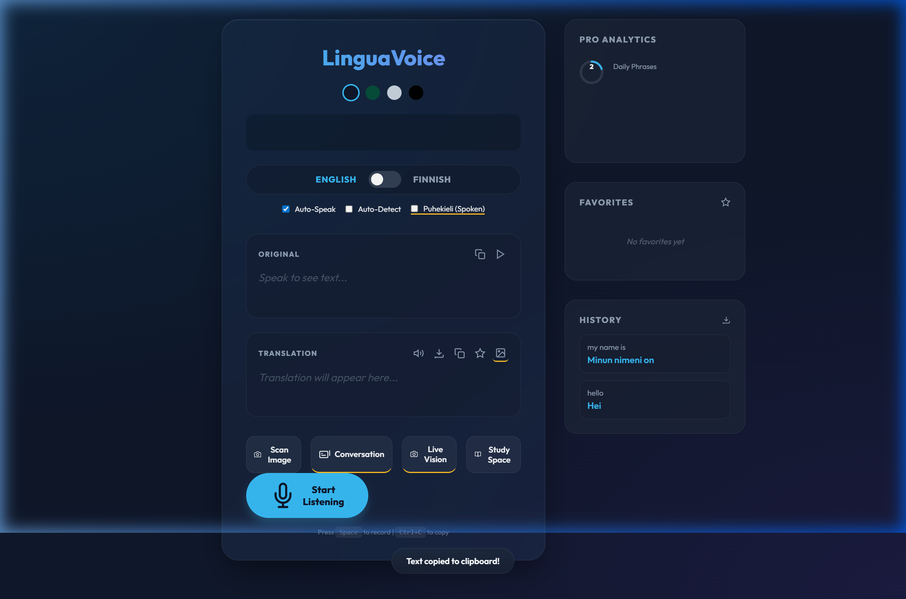

# LinguaVoice v6.1 (Pro Multimodal)

**LinguaVoice Pro** is a professional-grade, real-time voice translation and language learning suite.



## ✨ Features

- **🎥 Live Vision 2.0 (v6.1)**: Professional AR camera translation with **ROI Cropping** and **Fuzzy Stability** for steady, high-speed interpretation.
- **🎬 Movie-Style Subtitles**: Dynamic subtitle overlay that displays live voice and vision translations at the bottom of the screen.
- **🎓 Pro Learning Suite**:
  - **Study Space**: Practice your favorite phrases with an interactive Flashcard system.
  - **Daily Goals**: Track your daily translation count with a progress ring.
- **📸 Pro Intelligence**:
  - **OCR Translation**: Extract and translate text from images and menus using Tesseract.js.
  - **AI Tone Control**: Switch between Formal and Spoken (*Puhekieli*) Finnish.
  - **Grammar Insights**: Contextual hints for Finnish case endings.
- **🤝 Conversation Mode**: A specialized split-screen UI for two-way spoken interpretation.
- **📈 Advanced Analytics**: GitHub-style activity line charts tracking your learning progress.
- **🖼️ Social Quote Cards**: Export translations as beautiful, themed images ready for sharing.
- **🎙️ Real-time Voice Recognition**: Powered by the Web Speech API for high-accuracy, low-latency transcription.
- **🎨 Premium UI/UX (v4.0)**:
  - **Glassmorphism 2.0**: High-blur cards with subtle inner glows.
  - **Premium Typography**: Modern 'Outfit' font for better readability.
  - **Smooth Animations**: Animated entry effects and interactive scale transitions.
- **🌈 Visualizer 2.0**: Enhanced frequency bars with dynamic gradients and glow.
- **⌨️ Keyboard Shortcuts**:
  - `Space`: Start/Stop recording.
  - `Ctrl+C`: Copy translation.
- **🗣️ Advanced Audio Tools**:
  - **Auto-Speak**: Hear translations automatically.
  - **Original Playback**: Listen to your own transcribed voice.
  - **Voice Commands**: Control the UI with your voice (e.g., "Switch theme").
- **🧠 Intelligent Utilities**:
  - **Favorites**: Star important phrases for quick access.
  - **History**: View and manage your recent translation history.
  - **Export**: Download your translation session as a `.txt` file.
- **📱 PWA Support**: Fully installable on mobile and desktop as a Progressive Web App.

## 🛠️ Technology Stack

- **Frontend**: Vite + Vanilla JavaScript
- **Styling**: Pure CSS with advanced CSS Variables and Backdrop Filters
- **APIs**:
  - [Web Speech API](https://developer.mozilla.org/en-US/docs/Web/API/Web_Speech_API) (Recognition & Synthesis)
  - [MyMemory Translation API](https://mymemory.translated.net/doc/spec.php)
  - [Web Audio API](https://developer.mozilla.org/en-US/docs/Web/API/Web_Audio_API) (Visualizer)

## 🚀 Getting Started

### Prerequisites

- Node.js installed on your machine.
- A modern browser with Speech Recognition support (Chrome, Edge, etc.).

### Installation

1. Clone the repository:
   ```bash
   git clone https://github.com/ahadbd/lingua-voice.git
   ```
2. Navigate to the project directory:
   ```bash
   cd lingua-voice
   ```
3. Install dependencies:
   ```bash
   npm install
   ```
4. Start the development server:
   ```bash
   npm run dev
   ```

## 🎙️ Voice Commands

While listening, you can try saying these commands:
- `"Switch theme"`: Cycles through available color themes.
- `"Clear history"`: Wipes your recent translation history.
- `"Clear favorites"`: Wipes your bookmarked phrases.

## 📝 License

Distributed under the MIT License. See `LICENSE` for more information.

---
Created with ❤️ by Antigravity (Google DeepMind) for Ahad.
